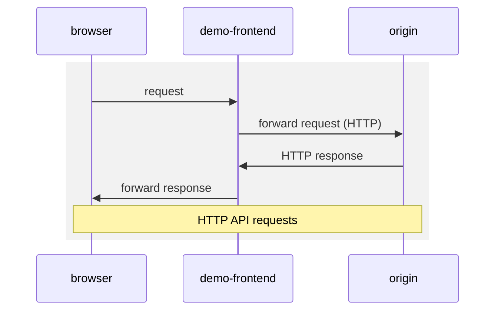
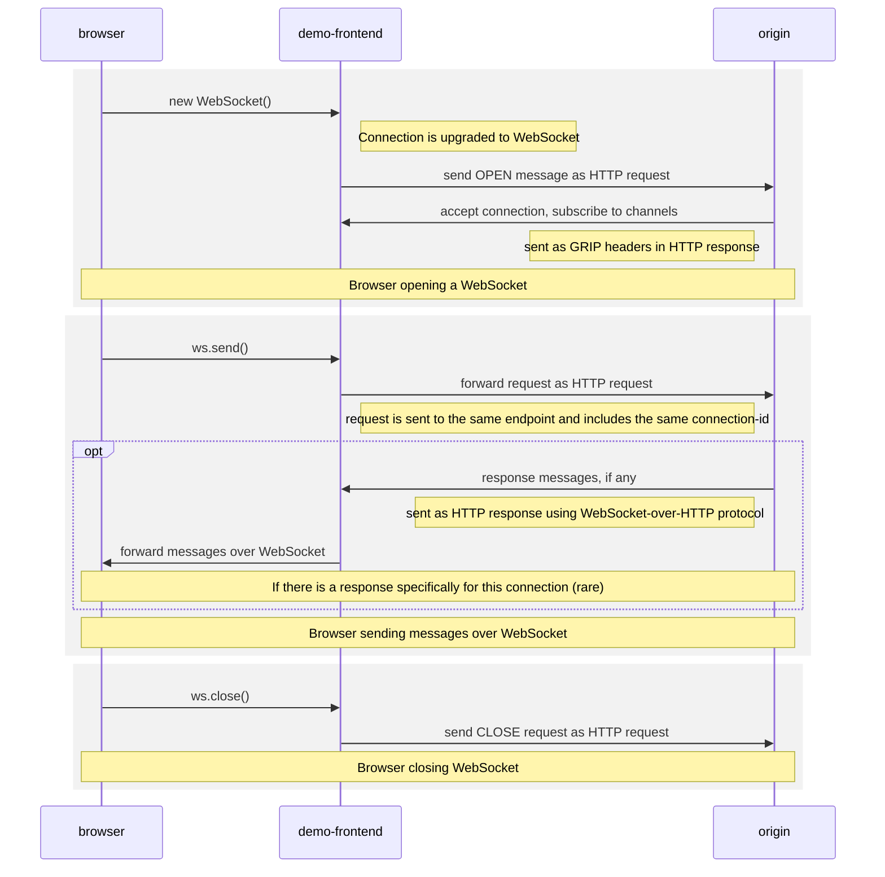
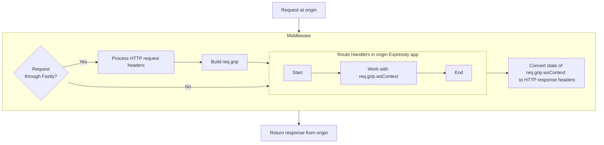
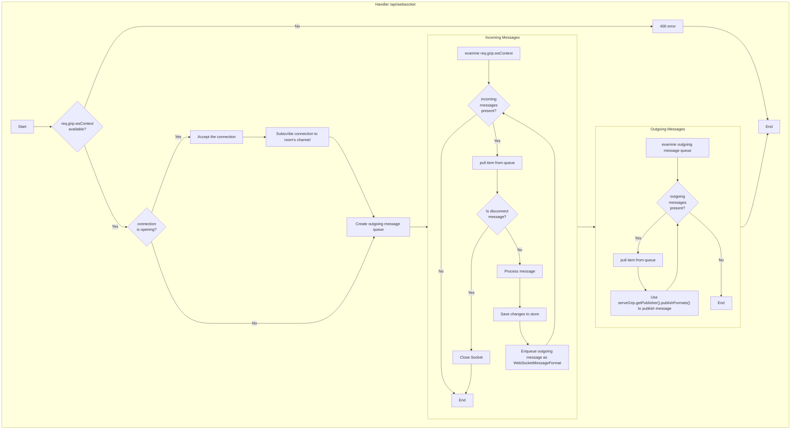

# Fanout WebSockets Compute@Edge Demo

This demo app shows how Fastly Fanout and the GRIP libraries can be used to serve WebSockets
at the edge.

[WebSocket](https://datatracker.ietf.org/doc/html/rfc6455) is a mechanism that allows browsers to keep an open data channel with
a server. This channel can be used to send and receive updates in real time, enhancing the user experience
with a sense of always-up-to-date freshness, and for multi-user applications, togetherness with other users.

Implementing WebSocket support for an application has typically meant that the origin server must hold and maintain
all of these connections.

With Fastly Fanout and the open [WebSocket-Over-HTTP Protocol](https://pushpin.org/docs/protocols/websocket-over-http/) standard,
Compute@Edge holds all of these WebSocket connections for you at the edge, so that your origin can focus on business logic.

Once the client application makes a WebSocket connection, the origin subscribes that connection to any number of
named "channels" (derived from the room name in the above example). Then, when the origin wishes to send data
over these connections, it does this by making its own HTTP requests to a publishing endpoint and referencing
that channel name.

The client may also send messages over that connection. Those messages arrive at the origin in the form of
HTTP POST requests.

In this example, the origin is also a Compute@Edge app, written in JavaScript.

## Live Demo

This demo is a realtime-updating "question and answer" board for a live event, online or offline. Attendees at
an event join a room and may post questions. The organizer is able to reply to the questions or delete them. The changes
propagate immediately to all connected participants over WebSockets.

Visit [https://qa-websockets-demo.edgecompute.app/](https://qa-websockets-demo.edgecompute.app/) to see this demo in action.

Try:

* Open the app URL https://qa-websockets-demo.edgecompute.app/ in two or more browser windows at the same time. Or for
  more fun, give your friend the URL and join together.

* In each browser window, pick a name, and join a room. Any name can be used as a room. You can try `fastly`, `fastlyparty`,
  or `random`. Or pick any name you like, and you can create your own room. Just make sure everyone joins the same room.

* Post a question by typing into the box at the bottom. Moments later it shows up on everybody else's screen.

* Any questions you enter will begin with one upvote -- yours. But go ahead and upvote the questions that were entered by other users.
  Those upvotes will show up in everyone's screens.  And see questions with more votes move to the top.

* The person who created the room, or anyone who checked `join as host` on the entry screen, will see buttons to reply
  to questions. Submit an answer to a question. The answer shows up on everyone else's screen.

* If a host thinks a question is inappropriate, they can delete it. The question disappears from everyone's screen right away.

* If you're a host, you can tap the pencil next to the room name to edit the name and color theme of a room. Those changes
  are seen by other users too.

* Finally, you can change the way your own name is displayed. Tap the down arrow by your username up top, and enter a new name.
  Everyone will see those changes right away.

## Structure

This app comprises four components:

| Path                                     | Component       | Description                                                                                                                                                                                                                                                                               |
|------------------------------------------|-----------------|-------------------------------------------------------------------------------------------------------------------------------------------------------------------------------------------------------------------------------------------------------------------------------------------|
| /src[/client](/src/client)               | `client`        | The client app that users interact with. This app is simply an interface for displaying data and interacting with the API (`demo-frontend` proxying to `origin`). Written in TypeScript, with React. Built into static output files by Webpack, and eventually served by `demo-frontend`. |
| /src[/demo-frontend](/src/demo-frontend) | `demo-frontend` | The internet-facing website, running on Compute@Edge. Serves application static files (`client`) and forwards API requests to `origin`. Among this is the ability to upgrading applicable connections to WebSocket. Written in Rust.                                                      |
| /src[/origin](/src/origin)               | `origin`        | Handles API requests for the application, including a handler for WebSockets, running on Compute@Edge. Written in TypeScript.                                                                                                                                                             |
| /src[/persistence](/src/persistence)     | `persistence`   | An in-memory store of the data used by the application. Written in TypeScript, and should be run on a Node.js server.                                                                                                                                                                     |

## How it works

When the visitor first opens `demo-frontend` in their browser, the static files that make up the `client` app are downloaded,
and the visitor can interact with the app. The `client` app is written as a React app that opens a WebSocket connection to the
`/api/websocket?roomId=<roomname>` endpoint on `demo-frontend`. Once the user is in a room, interactions with the app are
sent over the WebSocket.

`demo-frontend` is a Compute@Edge app (written in Rust) that forwards API requests to `origin`.

When a client sends a request to open a WebSocket, that request is 'upgraded' by the `upgrade_websocket` as it is forwarded.
After this upgrade, Fastly Fanout will hold and continue to hold the WebSocket connection with the client. Moreover, it will
translate any WebSocket messages into HTTP, via the [WebSocket-Over-HTTP Protocol](https://pushpin.org/docs/protocols/websocket-over-http/).
Therefore, together with the other REST API calls that are forwarded, all API calls are HTTP requests by the time they reach
`origin`.

`origin` is written as a Compute@Edge app in JavaScript. This app uses Fastly's [Expressly](https://github.com/fastly/expressly)
for routing, and `js-serve-grip-expressly` as a middleware library to work with [GRIP](https://pushpin.org/docs/protocols/grip/),
the protocol used by Fastly Fanout for realtime. This middleware is able to discern whether an incoming request has
come through Fastly and has been upgraded. And if so, it parses relevant headers and WebSocket messages into objects
that are easy to interact with.

The `POST /api/websocket` route is central, as it handles all WebSocket activity. It's important to note that this route is called
once for every activity that comes in over that WebSocket over its lifetime between a single browser window and Fastly,
including connecting and disconnecting, as well as the individual messages sent from the client. In this app, this route
handler handles a new connection by registering it with a channel name, and then iterating any incoming WebSocket messages
to individually process them. Some of this processing will, in turn, result in a need to broadcast messages to all connected
clients. For this purpose, it uses the underlying GRIP mechanism to post a message, tagged with the channel name, to a
publishing endpoint (identified by a GRIP_URL).

Sending to the publishing endpoint will cause Fastly to propagate this message to all `client` instances connected and
listening on that channel. The `client` now handles the WebSocket message received from the server, by updating local
state and UI.

Publishing messages to the publisher is not limited to during the process of a WebSocket message, though the `origin` program
in this application does not perform them outside this process. In fact, any application that knows your publisher
secret may publish messages at any time. Because the `GRIP_URL` encodes this secret, you need to keep it safe and treat it
as you would any other access token.

Keep in mind these WebSocket connections are not peer-to-peer, but rather server-client. When realtime activity occurs,
such as when a visitor submits a question, or when the host submits an answer, the messages travels from that user's
browser window through the WebSocket to Fastly. `origin` handles the request, at the edge, sometimes issuing a message
to the publisher endpoint. In any case, all messaging takes place between the browser and Fastly, and then from Fastly to
the many other browsers connected to Fastly.

## Running the Demo Locally

In order to run the demo locally, you will need to replace the functionality of `demo-frontend` with the open-source
[Pushpin server](https://pushping.org). The [/pushpin](./pushpin) directory contains files that will help you to run
Pushpin.

TODO: More details here.

## Issues

If you encounter any non-security-related bug or unexpected behavior, please [file an issue][bug]
using the bug report template.

[bug]: https://github.com/fastly/fanout-compute-js-demo/issues/new?labels=bug

### Security issues

Please see our [SECURITY.md](./SECURITY.md) for guidance on reporting security-related issues.

## License

[MIT](./LICENSE).
