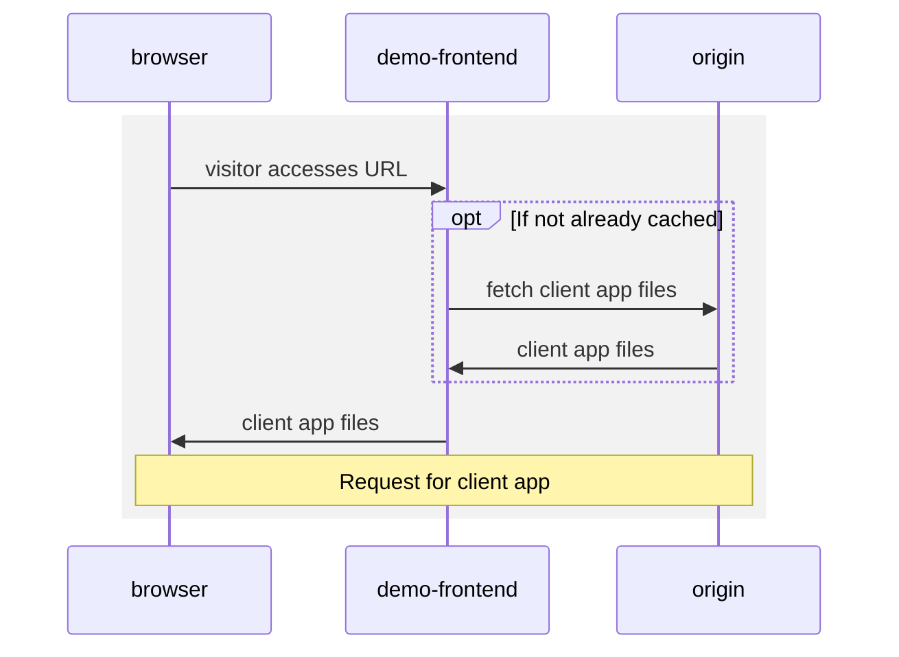
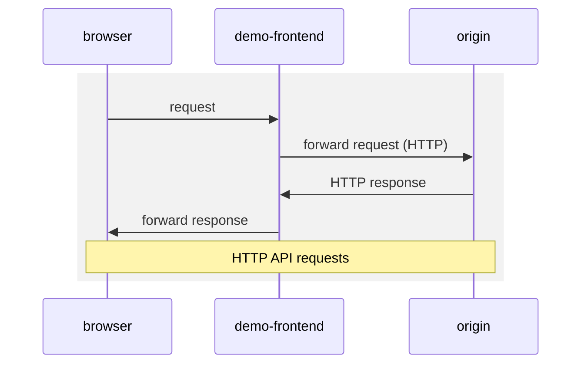
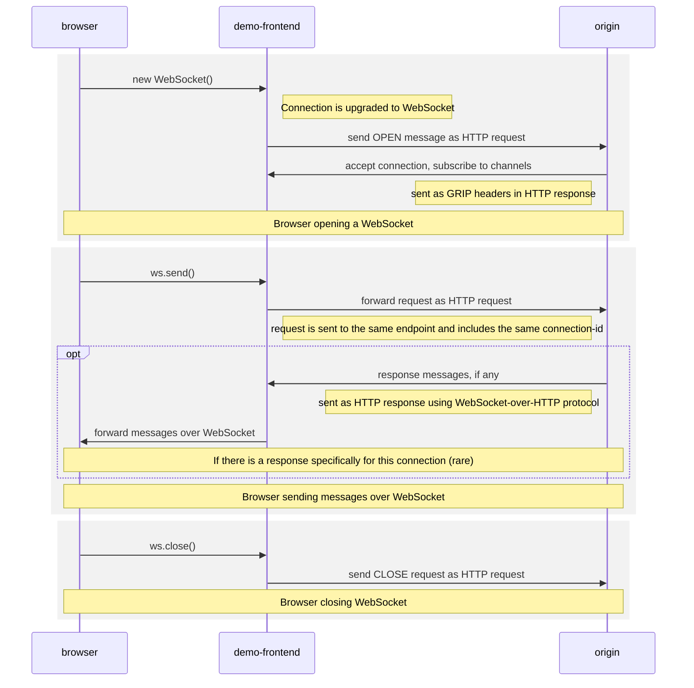
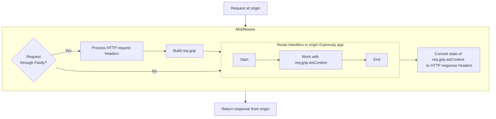
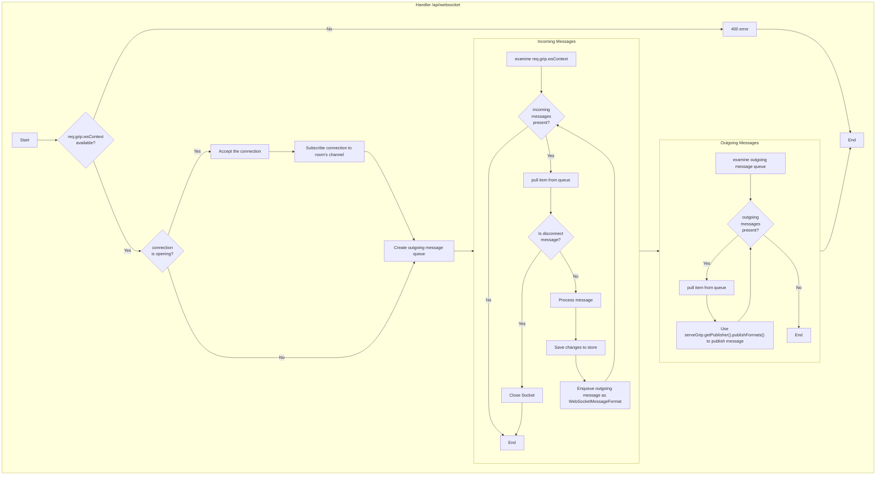

# Fanout WebSockets Demo for Compute

This demo app shows how Fastly Fanout and the GRIP libraries can be used to serve WebSockets
at the edge.

[WebSocket](https://datatracker.ietf.org/doc/html/rfc6455) is a mechanism that allows browsers to keep an open data channel with
a server. This channel can be used to send and receive updates in real time, enhancing the user experience
with a sense of always-up-to-date freshness, and for multi-user applications, togetherness with other users.

Implementing WebSocket support for an application has typically meant that the origin server must hold and maintain
all of these connections.

With Fastly Fanout and the open [WebSocket-Over-HTTP Protocol](https://pushpin.org/docs/protocols/websocket-over-http/) standard,
a Compute service holds all of these WebSocket connections for you at the edge, so that your origin can focus on business logic.

Once the client application makes a WebSocket connection, the origin subscribes that connection to any number of
named "channels" (derived from the room name in the above example). Then, when the origin wishes to send data
over these connections, it does this by making its own HTTP requests to a publishing endpoint and referencing
that channel name.

The client may also send messages over that connection. Those messages arrive at the origin in the form of
HTTP POST requests.

In this example, the origin is also a Compute app, written in JavaScript.

## Live Demo

This demo is a realtime-updating "question and answer" board for a live event, online or offline. Attendees at
an event join a room and may post questions. The organizer is able to reply to the questions or delete them. The changes
propagate immediately to all connected participants over WebSockets.

Visit [https://qa-websockets-demo.edgecompute.app/](https://qa-websockets-demo.edgecompute.app/) to see this demo in action.

Try:

* Open the app URL https://qa-websockets-demo.edgecompute.app/ in two or more browser windows at the same time. Or for
  more fun, give your friend the URL and join together.

* In each browser window, pick a name, and join a room. Any name can be used as a room. You can try `fastly`, `fastlyparty`,
  or `random`. Or pick any name you like, and you can create your own room. Just make sure everyone joins the same room.

* Post a question by typing into the box at the bottom. Moments later it shows up on everybody else's screen.

* Any questions you enter will begin with one upvote -- yours. But go ahead and upvote the questions that were entered by other users.
  Those upvotes will show up in everyone's screens.  And see questions with more votes move to the top.

* The person who created the room, or anyone who checked `join as host` on the entry screen, will see buttons to reply
  to questions. Submit an answer to a question. The answer shows up on everyone else's screen.

* If a host thinks a question is irrelevant, they can delete it. The question disappears from everyone's screen right away.

* If you're a host, you can tap the pencil icon next to the room name to edit the name and color theme of a room. Those
  changes are seen by other users too.

* Finally, you can change the way your own name is displayed. Tap the down arrow by your username up top, and enter a new name.
  Everyone will see those changes right away.

## Structure

This app comprises four components:

| Path                                     | Component       | Description                                                                                                                                                                                         |
|------------------------------------------|-----------------|-----------------------------------------------------------------------------------------------------------------------------------------------------------------------------------------------------|
| /src[/demo-frontend](/src/demo-frontend) | `demo-frontend` | The visitor-facing edge application, running on Fastly Compute. Forwards requests to `origin`. Applicable Websocket connections are upgraded and forwarded as HTTP-over-WebSocket. Written in Rust. |
| /src[/client](/src/client)               | `client`        | The client app that users interact with. This app is an interface that works with `origin`'s REST and WebSocket APIs. Written in TypeScript, with React.                                            |
| /src[/origin](/src/origin)               | `origin`        | Serves the static files that make up `client`, and handles API requests for the application, including a handler for WebSockets. Running on Fastly Compute, written in TypeScript.                  |
| /src[/persistence](/src/persistence)     | `persistence`   | An in-memory store of the data used by the application. Written in TypeScript, runs on Node.js.                                                                                                     |

## How it works

Note: The diagrams in this section may not render on the GitHub mobile app. If you do not see them, please use a web browser to view this page.

The browser interacts with [https://qa-websockets-demo.edgecompute.app/](https://qa-websockets-demo.edgecompute.app/),
which corresponds to `demo-frontend` in the table above. This is a Fastly Compute app (written in Rust) that forwards
requests to `origin` (referred to by the backend name `edge_app`). Standard HTTP requests (static files and API requests) are
forwarded through directly. WebSocket requests are upgraded, and the connection is held open, with traffic over that
connection forwarded as WebSocket-over-HTTP requests.

When the visitor first opens the application in their browser, the static files that make up the `client` app are downloaded,
and the visitor can begin to interact with the app.



The `client` app is written as a React app. The app makes informational requests, such as obtaining state about a room or
a user, over normal HTTP requests.



Once the user is in a room, the app opens a WebSocket connection to the `/api/websocket?roomId=<roomname>` endpoint.
Unlike the HTTP requests, these connections are held open. Realtime updates, such as new questions, new answers, upvotes,
etc. are sent and received over the connection.

When `demo-frontend` receives a request to open a WebSocket, it calls `req.upgrade_websocket("edge_app")` to 'upgrade' that
request. `edge_app` is the name of the backend that refers to `origin` as configured in the Fastly service.
After this upgrade, Fastly will continue to hold the WebSocket connection with the client. Moreover, it will translate
any WebSocket events and messages over that connection into HTTP requests, via the [WebSocket-Over-HTTP Protocol](https://pushpin.org/docs/protocols/websocket-over-http/).
Therefore, together with the other requests described above, all requests are HTTP requests by the time they reach
`origin`.



`origin` is a Compute app written in TypeScript. This app uses [@fastly/expressly](https://github.com/fastly/expressly)
for routing, with [`@fastly/serve-grip-expressly`](https://github.com/fastly/js-serve-grip-expressly) as middleware to
work with [GRIP](https://pushpin.org/docs/protocols/grip/), the protocol used by Fastly Fanout for realtime. This
middleware is able to discern whether an incoming request has come through Fastly Fanout. And if so, it parses relevant
headers and WebSocket messages into objects that are easy to interact with.



The `POST /api/websocket` route is central, as it handles all WebSocket activity. It's important to note that this route is called
once for every activity that comes in over that WebSocket over its lifetime between a single visitor and Fastly, including
connecting and disconnecting, as well as the individual messages sent from the visitor. In this app, this route
handler handles a new connection by registering it with a channel name, and then iterating any incoming WebSocket messages
to individually process them. Some of this processing will, in turn, result in a need to broadcast messages to all connected
clients. For this purpose, it uses the underlying GRIP mechanism to post a message, tagged with the channel name, to a
publishing endpoint (identified by a `GRIP_URL`).



Making a request to the publishing endpoint will cause Fastly to propagate this message to all WebSockets connected and
listening on the specified channel. The `client` app handles the WebSocket message received from the server, by updating
local state and UI.

Keep in mind these WebSocket connections are not peer-to-peer, but rather server-client. When realtime activity occurs,
such as when a visitor submits a question, or when the host submits an answer, the messages travels from that visitor
through the WebSocket to Fastly. `origin` handles the request, sometimes issuing a message to the publisher endpoint.
In any case, all messaging takes place between the browser and Fastly, and then from Fastly to the many other browsers
whose WebSocket connections are held by Fastly.

Note that `origin` is itself an application running on Compute. This means that all business logic for this app runs
at the edge.

## Running the Demo Locally

To run this demo, you will need Node.js (>= 16.9), Fastly CLI, and Docker.

Fastly's [local development server](https://developer.fastly.com/learning/compute/testing/#running-a-local-testing-server)
is typically used to run and develop Compute programs locally. However, this development server does not include
Fastly Fanout features. For this reason, we use it for `origin`, but it cannot be used to run `demo-frontend`.

The open-source [Pushpin server](https://pushpin.org) does exactly what we need here. Pushpin provides exactly the same
functionality as `demo-frontend` described above. The [/pushpin](./pushpin) directory in this repo contains files that
will help you to run Pushpin. Pushpin is provided as a Docker configuration to provide better compatibility, especially
with ARM Macs.

1. Check out a copy of this repository.
2. If you don't have [Corepack](https://github.com/nodejs/corepack#readme) enabled, enable it with `corepack enable`.
3. `pnpm install`
4. `pnpm build-all`

Next, you will need to run these apps, in separate Terminal windows:

| Component                                        | Directory          | Command      | Address                                                          |
|--------------------------------------------------|--------------------|--------------|------------------------------------------------------------------|
| Pushpin                                          | `/pushpin`         | `pnpm start` | http://localhost:7999/ <br />(Publisher: http://localhost:5561/) |
| `persistence` <br />(Node.js)                    | `/src/persistence` | `pnpm dev`   | http://localhost:3001/                                           |
| `origin` <br />(Fastly local development server) | `/src/origin`      | `pnpm dev`   | http://localhost:8000/                                           |
| `client` <br />(Webpack development Server)      | `/src/client`      | `pnpm dev`   | http://localhost:3000/                                           |

Once all the components are running, open [http://localhost:7999/](http://localhost:7999/) in your browser.

### Constants

In each component, constants are defined to help the components find each other. 

#### Pushpin

`/pushpin/config/routes`:
```
*,as_host=localhost:8000 host.docker.internal:8000,over_http
```

#### Origin

`/src/origin/src/env.ts`:
```javascript
export const GRIP_URL = 'http://localhost:5561/?backend=grip-publisher';
export const PERSISTENCE_URL_BASE = 'http://localhost:3001/';
export const PERSISTENCE_BACKEND = 'backend-persistence';
```

`/src/origin/fastly.toml`:
```toml
[local_server]

  [local_server.backends]

    [local_server.backends.grip-publisher]
      url = "http://localhost:5561/"

    [local_server.backends.backend-persistence]
      url = "http://localhost:3001/"
```

#### Client

`/src/clients/src/constants.ts`:
```javascript
export const WEBSOCKET_URL_BASE = 'ws://localhost:7999/api/websocket';
export const API_URL_BASE = 'http://localhost:7999/';
```

## Issues

If you encounter any non-security-related bug or unexpected behavior, please [file an issue][bug]
using the bug report template.

[bug]: https://github.com/fastly/fanout-compute-js-demo/issues/new?labels=bug

### Security issues

Please see our [SECURITY.md](./SECURITY.md) for guidance on reporting security-related issues.

## License

[MIT](./LICENSE).
